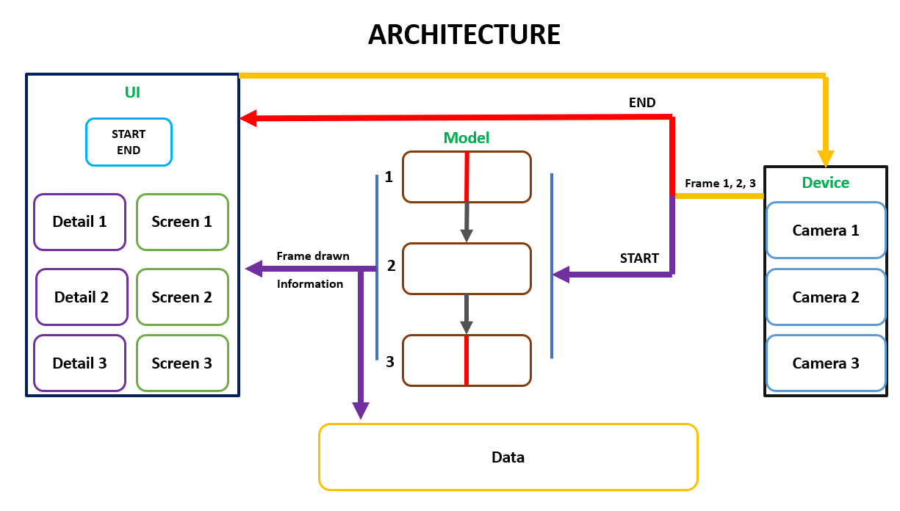
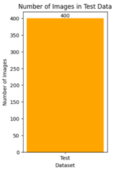
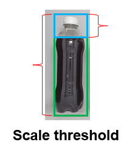
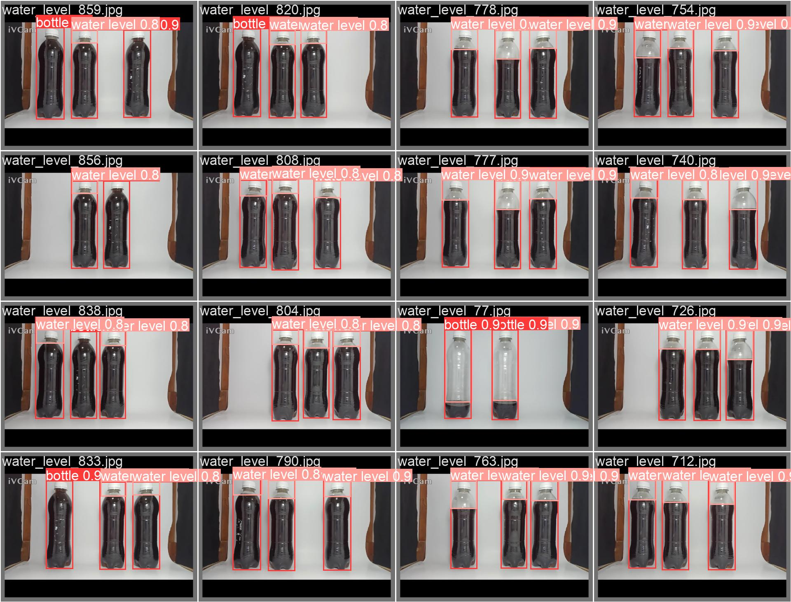
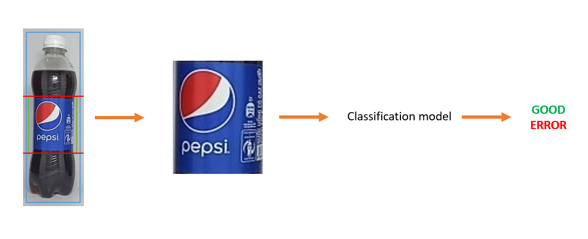
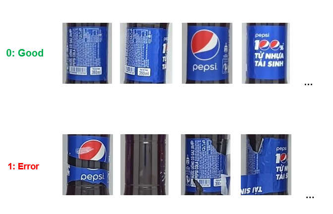
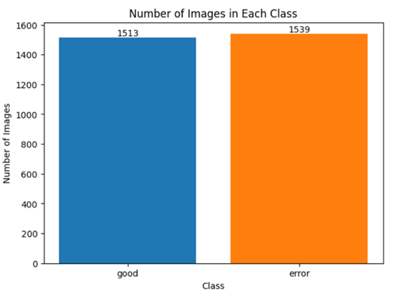

# **Welcome to GROUP 3 💞**
## **----- DETECTIVE - Advanced Quality Control System for Bottled Water Production ------**

# ***Smart Bottle Inspector*

## **Overview**

*Detective is an advanced quality control system designed to identify and rectify errors in the bottled water production industry, with a specific focus on Pepsi bottle production. This project is developed as part of the DPL302m course.*

## **The Team**

- AI - Branch

    + Leader - AI: Nguyen Van Thu 
    + Email: nguyenvanthu958@gmail.com
    + GitHub: https://github.com/Novanv

- Team Members - AI DATA:
    + Dang Phuc Bao Chau
    + Email: dangbaochau2111@gmail.com
    + GitHub: https://github.com/dangchau2111

    + Nguyen Quoc Vuong
    + Email: quocvuong18022003@gmail.com
    + GitHub: https://github.com/Niel-Nguyen

    + Nguyen Ngoc Phuc
    + Email: tmphucsay@gmail.com
    + Github: https://github.com/PhucCodeLo

- UI - Branch
    + UI Specialist: Ha Khai Hoan
    + Email: khaihoan.ai@gmail.com
    + GitHub: https://github.com/Hoanha2101

- Contributing
+ We welcome contributions! If you want to contribute to DetecTive, please follow these guidelines:

Fork the repository.
Create a new branch: git checkout -b feature/new-feature.
Commit your changes: git commit -m 'Add new feature'.
Push to the branch: git push origin feature/new-feature.
Submit a pull request.

- Contact
+ For any inquiries or feedback, please reach out to the project team:

+ Email: khaihoan.ai@gmail.com
+ Thank you for your interest in DetecTive - Making bottled water production error!

## **Architecture, way of doing things**

The product is an application to check product defects on the bottled water production line system.
The product includes 3 modules corresponding to each stage of packaging a bottle of water before bringing the product to market:

- BOTTLE CHECK: check whether the shape of the water bottle matches the water bottle standards set by the manufacturer.
- WATER LEVEL CHECK: check whether the water level matches the standard water level, not higher, not lower.
- LABEL CHECK: check the integrity of the label.

*Product interface*

## **ARCHITECTURE**

Currently, the system operates with one main thread, processing frames received from three cameras one after another.

#### **Technology**
<ul>
<li>Yolov8</li>
<li>CNN</li>
<li>Image processing</li>
</ul>

## **STEP**

### **BOTTLE CHECK**

#### **Classification data**

We perform labeling with 2 sets of photos: good and error

+ Class:

+ Train set & Test set:

#### **Training**

| Model	| CNN (custom) | VGG16 | RESNET18 |	RESNET18 (3,90,270) |
| -----	| ------------ | ----- | -------- | ------------------- |
| Number of parameters | 79.905.560 | 39.896.898 | 11.188.354 | 11.188.354 |
| Accuracy (on test set) | 96.4% | 42.8% | 95.2% |	98.8%	|
| Prediction time/Image (milliseconds) | ~92.69 | ~161.18 | ~102.53	| ~94.7 |
| Model size (Megabyes) | 304.82 | 152.19 | 42.68 | 42.68 |

### **WATER LEVEL CHECK**

With this module we use the detect function of the yolov8m model. Use algorithms to eliminate areas of void above the water level if the intersection area between the void object above the water level and the water bottle is less than a threshold, which has been previously set.

Besides building the model, we also design an ideal background for the model to perform its tasks well, without interference from the outside environment.

+ The prediction results on the test set are quite good.

#### **Data**

*Labeling tool: https://www.makesense.ai/*

- Train set: 804
- Test set: 100

### **LABEL CHECK**

With this module, we continue to train the detection model with Yolov8, we proceed to label the training set, with 2 objects: label and water bottle. We can absolutely use the pre-trained model with classes = 39 of yolov8 or train a model ourselves to accurately identify the water bottle object, then extract the label region using image processing.

#### **Classification data**

We have a data set with angles of good labels and error labels.

+ Train set:

+ Test set:

#### **Training**

| Model	| CNN (custom) | VGG16 | VGG19 | RESNET18 |	RESNET34 |
| -----	| ------------ | ----- | ----- | -------- |	-------- |
| Number of parameters | 23.760.162 |15.766.850 | 21.076.546 |12.600.450 | 23.290.178 |
| Accuracy (on test set) | 94.5% | 94.75% | 93.25% | 96.75%	| 95.75% |
| Prediction time/Image (milliseconds) | ~90.88 | ~67.25 | ~86.46	| ~88.34 | ~70.94 |
| Model size (Megabyes) | 271.98 | 68.25 | 88.51 | 144.55 | 267.19 |

