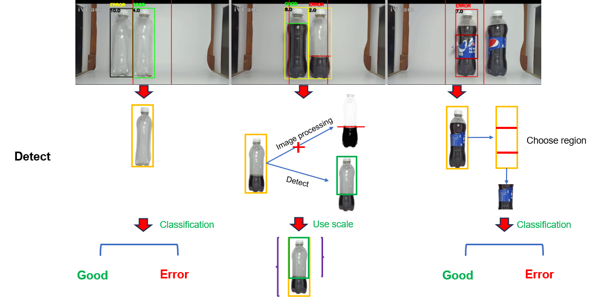
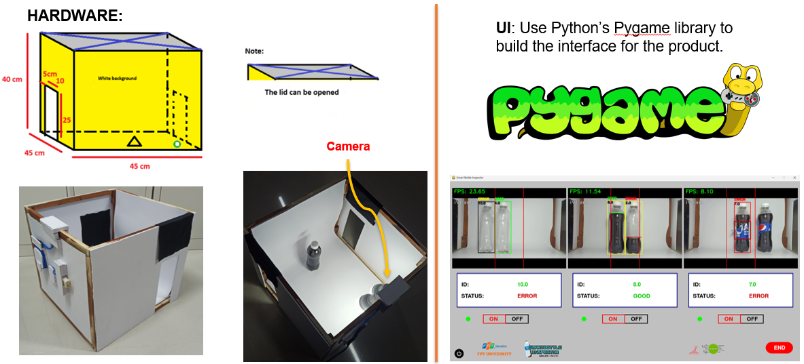
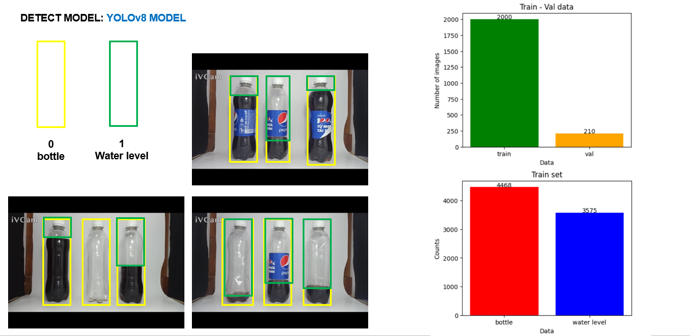
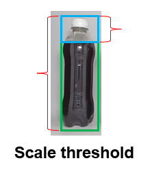

# **Welcome to GROUP 3 💞**
# DETECTIVE - Advanced Quality Control System for Bottled Water Production

# *Smart Bottle Inspector*

## **Overview**

*Detective is an advanced quality control system designed to identify and rectify errors in the bottled water production industry, with a specific focus on Pepsi bottle production. This project is developed as part of the DPL302m course.*

## **The Team**

- AI - Branch

    + Leader - AI: Nguyen Van Thu 
    + Email: nguyenvanthu958@gmail.com
    + GitHub: https://github.com/Novanv

- Team Members - AI DATA:
    + Dang Phuc Bao Chau
    + Email: dangbaochau2111@gmail.com
    + GitHub: https://github.com/dangchau2111

    + Nguyen Quoc Vuong
    + Email: quocvuong18022003@gmail.com
    + GitHub: https://github.com/Niel-Nguyen

    + Nguyen Ngoc Phuc
    + Email: tmphucsay@gmail.com
    + Github: https://github.com/PhucCodeLo

- UI - Branch
    + UI Specialist: Ha Khai Hoan
    + Email: khaihoan.ai@gmail.com
    + GitHub: https://github.com/Hoanha2101


- Contributing

For contributor

+ We welcome contributions! If you want to contribute to DetecTive, please follow these guidelines:

Fork the repository.
Create a new branch: git checkout -b feature/new-feature.
Commit your changes: git commit -m 'Add new feature'.
Push to the branch: git push origin feature/new-feature.
Submit a pull request.

- Contact
+ For any inquiries or feedback, please reach out to the project team:

+ Email: khaihoan.ai@gmail.com
+ Thank you for your interest in DetecTive - Making bottled water production error!
## Run app

Download our [trained models](https://drive.google.com/drive/folders/11mO-hAM_6S8XBueTE16H98koMMrW6ExI?usp=sharing)

Download our [video_demo](https://drive.google.com/drive/folders/11mO-hAM_6S8XBueTE16H98koMMrW6ExI?usp=sharing)

*folder map*

```bash
\
    |---APP
    |---create_sample
    |---data
    |---data_mask
    |---illustration
    |---model_set
    |---TensorRT
    |---video_demo
    |---README.md
```

*Note*: When deploying tensorRT, there will be different plans for each different type of Nvidia GPU.

We are using `Nvidia GPU 3050`

Please use your own TensorRT plan implementation code.

```bash
\model_set
    |---classification
    |    |---onnx
    |    |   |---model_cls_bottle_v2.onnx
    |    |   |---model_cls_label.onnx
    |    |---org
    |    |   |---model_cls_bottle_v2.h5
    |    |   |---model_cls_label.h5
    |    |---tensorRT
    |    |   |---model_cls_bottle_v2.trt
    |    |   |---model_cls_label.trt
    |---detect
    |    |   |---best.engine
    |    |   |---best.onnx
    |    |   |---best.pt
```

Video

```bash
\video_demo
    |---bottle.avi
    |---label.avi
    |---wl.avi
```

Python version 3.9
```bash
python __app__.py
```

## **Architecture, way of doing things**

The product is an application to check product defects on the bottled water production line system.
The product includes 3 modules corresponding to each stage of packaging a bottle of water before bringing the product to market:

- BOTTLE CHECK: check whether the shape of the water bottle matches the water bottle standards set by the manufacturer.
- WATER LEVEL CHECK: check whether the water level matches the standard water level, not higher, not lower.
- LABEL CHECK: check the integrity of the label.

*Product interface*


## **STEP**

### **DEFINE SOLUTION**
With our product, to achieve the purpose of applying the product in practice, it is imperative that the product be deployed in real time, while achieving high accuracy, not affected by the environment.
We have streamlined the models as much as possible to reduce the use of multiple models, to accommodate deployment to mini hardware, such as Jetson nano, etc.
We do not use image processing methods here, because image processing depends heavily on the background.




### **ARCHITECTURE**

Currently, the system operates with one main thread, processing frames received from three cameras one after another.


## **HARDWARE - UI**



### **DETECTION MODEL**
We use the Yolov8 model, it is a SOTA detection model at the present time (December 20, 2023).
Use the parameters of the pretrain model (Yolov8m) to initialize the parameters quickly.
Through experiments, we have found that labeling the space above the water level will produce better detection results than labeling the exact black area of Pepsi water.



### **BOTTLE CHECK**

##### **Classification data**

We perform labeling with 2 sets of photos: good and error


+ Number of classes in training set:

```bash
Train set: 1121 images
Test set: 284 images
```

```bash
Train set:
    + good: 527 images
    + error: 594 images
```

#### **Training - Evaluation**

    * Resize: (90,270)

| Model	| CNN (custom) | VGG16 | VGG19 |	RESNET18 |
| -----	| ------------ | ----- | -------- | ------------------- |
| Number of parameters | 79.905.560 | 19.041.346 | 24.351.042 | 11.188.354 |
| Accuracy (on test set) | 98% | 95% | 99% |   96%	|
| Average speed (1/100 image) | 103.8 ms |  75.7 ms | 81.1 ms	|  70.9 ms |


### **WATER LEVEL CHECK**
Just detect two objects with the trained yolo model, then use the algorithm to manage which water level range belongs to which water bottle, then calculate the height threshold.





### **LABEL CHECK**

With this module, we continue to train the detection model with Yolov8, we proceed to label the training set, with 2 objects: label and water bottle. We can absolutely use the pre-trained model with classes = 39 of yolov8 or train a model ourselves to accurately identify the water bottle object, then extract the label region using image processing.

Or use Yolo model trained with 2 class: bottle, water level


#### **Classification data**

We have a data set with angles of good labels and error labels.

#### Train set:


```bash
- Total: 2980 images
    + good: 1501 images
    + error: 1479 images
```

#### Test set:
```bash
-Total: 400 images
```

#### **Training - Evaluation**

| Model	| CNN (custom) | VGG16 | VGG19 | RESNET18 |	RESNET34 |
| -----	| ------------ | ----- | ----- | -------- |	-------- |
| Number of parameters | 23.760.162 |15.766.850 | 21.076.546 |12.600.450 | 23.290.178 |
| Accuracy (on test set) | 92% | 95.5% | 96% | 96%	| 96.75% |
| Average speed (1/100 image) | 90.71 ms | 83.42 ms | 85.77 ms	| 67.46 ms | 78.77 ms |


### **OPTIMIZER**

*With our project*

```bash
TensorFlow FP32 ->  TensorRT Plan FP32
```
*Option  - More speed improvements*

```bash
Yolo FP32 -> TensorRT Plan FP16
TensorFlow FP32 ->  TensorRT Plan FP16 (INT8)
```


Reference:[TensorRT](https://github.com/NVIDIA/TensorRT)

### Thank you
