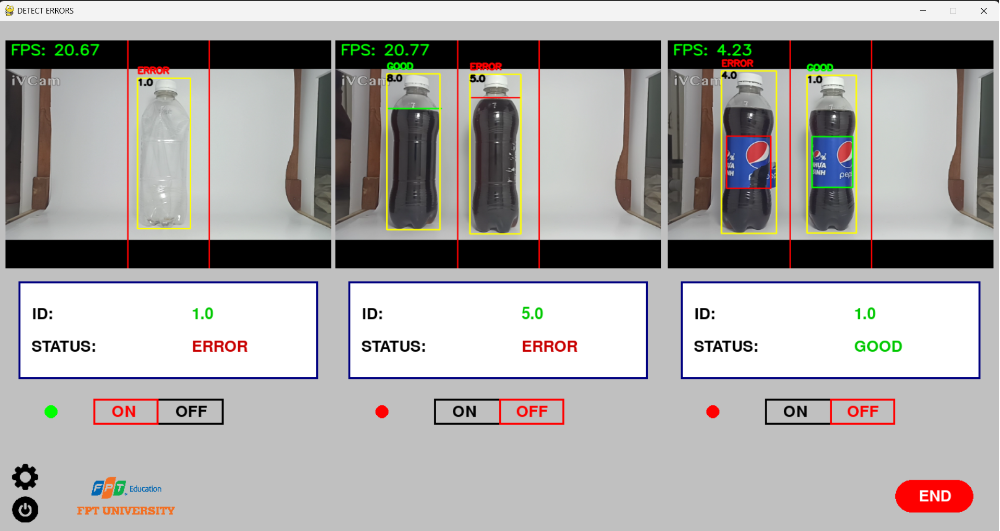

Welcome to GROUP 3 💞 
----- DETECTIVE - Advanced Quality Control System for Bottled Water Production ------

Overview

Detective is an advanced quality control system designed to identify and rectify errors in the bottled water production industry, with a specific focus on Pepsi bottle production. This project is developed as part of the DPL302m course.

The Team

- AI - Branch

    + Leader - AI: Nguyen Van Thu 
    + Email: nguyenvanthu958@gmail.com
    + GitHub: https://github.com/Novanv

- Team Members - AI DATA:
    + Dang Phuc Bao Chau
    + Email: dangbaochau2111@gmail.com
    + GitHub: https://github.com/dangchau2111

    + Nguyen Quoc Vuong
    + Email: quocvuong18022003@gmail.com
    + GitHub: https://github.com/Niel-Nguyen

    + Nguyen Ngoc Phuc
    + Email: tmphucsay@gmail.com
    + Github: https://github.com/PhucCodeLo

- UI - Branch
    + UI Specialist: Ha Khai Hoan
    + Email: khaihoan.ai@gmail.com
    + GitHub: https://github.com/Hoanha2101

- Contributing
+ We welcome contributions! If you want to contribute to DetecTive, please follow these guidelines:

Fork the repository.
Create a new branch: git checkout -b feature/new-feature.
Commit your changes: git commit -m 'Add new feature'.
Push to the branch: git push origin feature/new-feature.
Submit a pull request.

- Contact
+ For any inquiries or feedback, please reach out to the project team:

+ Email: khaihoan.ai@gmail.com
+ Thank you for your interest in DetecTive - Making bottled water production error!

## **Architecture, way of doing things**

